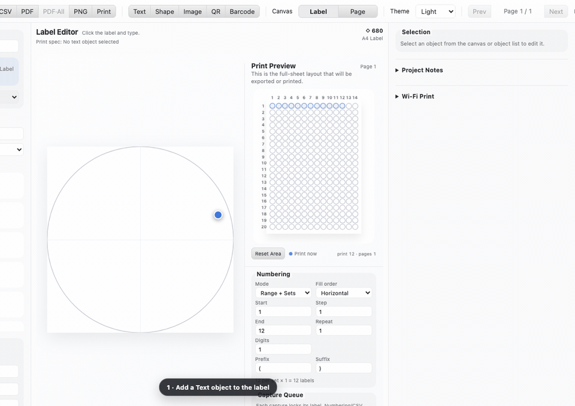

# iLabel Studio

**🌐 Homepage: [jaeyoonsung.github.io/iLabel-Studio](https://jaeyoonsung.github.io/iLabel-Studio/)** · [한국어](https://jaeyoonsung.github.io/iLabel-Studio/ko/)


`iLabel Studio` is a cross-platform precision label editor and printer built around **iLabel label sheets from `label.kr`**, while also supporting custom sheets and roll labels. It ships as a native SwiftUI app on macOS and as a feature-equivalent Electron app on Windows and Linux. Every edition shares the same project format, including rich text, embedded fonts, merge data, numbering, placement, and captured print queues.

## Install on macOS

Download `iLabel-Studio-macOS.dmg` from the latest release:

https://github.com/JAEYOONSUNG/iLabel-Studio/releases/latest

Open the DMG, drag `iLabel Studio.app` to `Applications`, then launch it.

Upgrading from the former `iLabel2Mac.app`? Quit the old app, install `iLabel Studio.app`, then remove the old app bundle. Existing projects and saved app preferences remain compatible.

## Releasing and auto-update

One command cuts a release for every platform:

```bash
node tools/release.mjs patch    # or minor, major, x.y.z; --dry to preview
```

It refuses a dirty tree or a failing suite, bumps the version, pushes tag `vX.Y.Z`, and waits for [the Release workflow](.github/workflows/release.yml) to build the macOS DMG and the Windows/Linux packages into one GitHub release. Only then does it point `feed.json` on `gh-pages` at the new version and verify everything is publicly reachable — the feed moves last so no copy of the app is ever told about a build it cannot download.

Installed copies check that feed on launch (and every six hours) and ask before acting. The Windows installer and the Linux AppImage download and install the update through electron-updater when told to; the macOS app, the portable Windows build, and `.deb` installs are offered the download instead.

## Install on Windows and Linux

Windows and Linux packages are built from [`desktop/`](desktop/):

- Windows x64: NSIS installer and portable `.exe`
- Linux x64: AppImage and Debian `.deb`

Every desktop change is packaged and exercised by [the desktop workflow](.github/workflows/desktop.yml). Open a successful run in [GitHub Actions](https://github.com/JAEYOONSUNG/iLabel-Studio/actions/workflows/desktop.yml) and download its `ilabel-studio-windows-x64` or `ilabel-studio-linux-x64` artifact:

- Windows: choose the NSIS setup `.exe` or the standalone portable `.exe`.
- Linux: choose the AppImage `.tar.gz` or Debian `.deb` package.

The Linux artifact wraps the AppImage in `tar.gz` so its executable permission survives download. Windows development artifacts are unsigned unless the repository's `WIN_CSC_LINK` and `WIN_CSC_KEY_PASSWORD` secrets are configured, so Windows may show a SmartScreen warning.

To build locally:

```bash
cd desktop
npm ci
npm test
npm run package:win    # run on Windows
npm run package:linux  # run on Linux
```

For development, use Node.js 22 and run `npm run dev` in `desktop/`. The workflow launches each packaged executable—not only the development server—and verifies the renderer, preload bridge, 1,006-format catalog, rich text, embedded fonts, PDF dimensions, circular layout, placement selection, and capture queue before publishing artifacts.

## Quick workflow: create a label and capture consecutive runs



The light-theme demo uses the Windows/Linux edition. It adds a Text object, types `Sample {{serial}}`, switches to Page Preview, captures **8 labels** (`End 4 × Repeat 2`), then stages an empty position and captures **3 more labels** (`End 3 × Repeat 1`).

1. Add **Text**, enter the label content or merge tokens, then switch to **Page Preview**. The large label canvas shows exactly what each printed cell contains.
2. Set the quantity with **Start**, **End**, **Step**, and **Repeat**. With CSV data, one label is generated per imported row.
3. Click a label cell to choose where the run starts, then choose **Capture Current Setup**. The artwork, data, quantity, page, and start position are locked together.
4. Click another empty label cell to stage the next capture. Use **Next** if you want to start on a blank sheet; the capture button stays disabled until a valid position is staged.
5. Adjust the next run's quantity, then choose **Capture Current Setup** again.
6. Reorder or remove captured runs if needed, then choose **Print Captures** to print the complete queue as one multi-page job.

## Features

- Native SwiftUI app for macOS and a feature-equivalent Electron app for Windows/Linux
- 1,006 official iLabel paper formats from `label.kr`, with every new project starting from iLabel format `680`, plus editable custom sheet/roll geometry
- Text, shape, image, QR, and Code128 elements
- Selection-level rich text: font, size, bold, italic, underline, and RGBA color
- macOS RTF compatibility and project-embedded TTF, OTF, WOFF, WOFF2, TTC, and OTC fonts
- Real installed-font metrics for line wrapping, including Korean text and merge tokens
- CSV merge tokens using `{{Column}}` and serial tokens using `{{serial}}`
- Capture queue that locks artwork, Numbering/CSV setup, page, and start position, then prints every capture in one multi-page job
- Full-circle text flow with chord-shaped lines and matching editor, preview, PDF, and print layout
- Page preview with per-slot merge rendering and rectangular drag selection
- macOS-matched three-pane layout, light/dark appearance, numbered page axes, and captured/next/overlap preview states
- JSON project save/load
- Exact-size PDF output and 720-DPI PNG output with physical-resolution metadata
- Windows print spool monitoring and Linux CUPS monitoring, with optional printer Wi-Fi switching only when the current network cannot drain the job
- Sanitized SVG import and deterministic raster-image normalization
- Windows/Linux installer builds and packaged-app smoke screenshots generated in CI

## Notes

- CSV import accepts comma, tab, semicolon, and pipe-delimited files.
- Dynamic tokens supported in text, QR, and barcode fields:
  - `{{serial}}`
  - `{{serial_raw}}`
  - `{{set}}`
  - `{{index_in_set}}`
  - `{{page}}`
  - `{{slot}}`
  - `{{row}}`
  - `{{date}}`
  - `{{time}}`
  - `{{ColumnName}}`
- macOS and Windows/Linux use the same project JSON schema. Rich-text RTF runs, embedded fonts, images, CSV data, numbering, placement, and capture queues round-trip between editions.
- When a project is saved, the Windows/Linux edition collects a local font face only when its OS/2 license flags permit editable embedding. Existing project fonts are preserved; make sure you also have permission to redistribute them.
- Windows Wi-Fi switching uses `netsh`; Linux uses NetworkManager's `nmcli`. Leave it disabled for printers already reachable on the current network.
- Windows/Linux image import supports PNG, JPEG, WebP, BMP, GIF (first frame), and sanitized SVG. Unsupported TIFF/HEIC input is rejected with an explicit error instead of producing a blank label.
- Printer drivers can apply their own non-printable margins. For custom roll sizes, create/select the matching paper size in the Windows or CUPS driver before printing.
